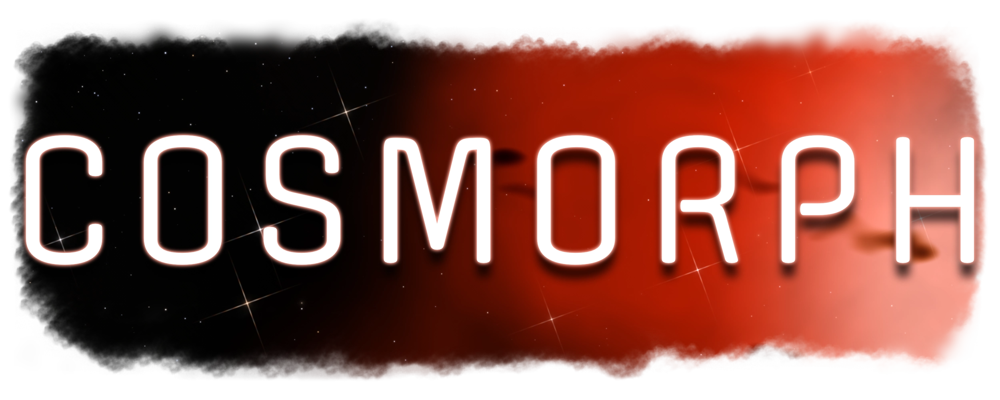

<h1 align="center">
  
</h1>

***A procedural cosmic background engine. Soothing, beautiful, deep-space scenes that gradually drift and evolve, so you can gaze into the vastness of space from the comfort of your own home. No telescope required.***

<em>To see it in action, please visit the <a href="https://cosmorph.app/"><b>Cosmorph homepage!</b></a></em>

---

***Cosmorph*** sprang ~~fully~~ semi-formed from the brow of Sam Atwood, who can't afford a fancy telescope or camera or anything like that, but thoroughly enjoys browsing the [astrophotography subreddit](https://reddit.com/r/astrophotography/) and [AstroBin](https://app.astrobin.com/) and decided to bring space down to him in a different fashion. It's designed to be enjoyed by anyone, endlessly configurable, and astronomically accurate (unless you'd rather it not be, which is also supported).

To test it out real quick, go to the web page at [cosmorph.app](https://cosmorph.app/) and click/tap Reroll Cosmos. You'll see. If you find one you like, note the URL — it'll say `?seed={big number}` and you can keep that for later reuse! :)

✨🧡🌌

## What's It Do?

Cosmorph replaces your desktop wallpaper with any patch of celestial majesty you care to look at. It comes preloaded with several real pretty space locations (*list pending, please hold!*) and can procedurally generate an infinite number of unique and (hopefully breathtakingly gorgeous) backgrounds that warp gently over time. It's completely customizable, has around 250–300 (and counting) hours of [research and development](https://mommyship.mom/galaxy.html) behind its shaders and visual design because I can't stop myself from learning space math, and it's almost entirely free!

- **Chill and Enjoy Space:** The idea behind this was "what if astrophotography and lava lamps had a baby" if that tells you anything about how it's meant to be enjoyed. Set it up however you like and then just watch the cosmos swirl. It works on any screen size and spreads across all your monitors.
- **Literally Reshape the Universe:** With [Firmament](https://cosmorph.app/firmament/), the scene creation studio, you can tweak absolutely any part of the scene you want or randomize it. If you find a nebula you like, you can lock it in place and keep randomizing until the vibes are *juuust right!* Once space looks good to you, you can use it in Wallpaper Engine on your PC or save & share a `.cosmos` file. So many sliders...
- **Respect to the OGs:** The seed used for the stars on the homepage is `9281980`, AKA September 28th, 1980, AKA the air date of the first episode of Carl Sagan's *Cosmos: A Personal Voyage*, AKA the best show ever.
- **No Bullshit:** No trackers, no ads, no subscriptions, no DRM. All basic functionality of Cosmorph is free for desktop users, with a paid option for real spaceheads who want total control coming Soon™. A paid Android app is also brewing.

## The Stellar Nursery

Here's what kinds of celestial phenomena you can expect to find floating around in Cosmorph (some of them are in-progress, just hold your Horseheads):
- So, so, *so* many stars of [all different kinds](https://en.wikipedia.org/wiki/Stellar_classification)
- [Nebulae](https://en.wikipedia.org/wiki/Nebula) (or nebulas, if you prefer) with a vast array of formations and colors
- Puffy volumetric [space dust](https://en.wikipedia.org/wiki/Cosmic_dust)
- [Bok globules](https://en.wikipedia.org/wiki/Bok_globule) aplenty (they look exactly how they sound lol)
- [Reflection nebulae](https://en.wikipedia.org/wiki/Reflection_nebula) glowing softly around extra-bright stars
- Wispy [supernova remnants](https://en.wikipedia.org/wiki/Supernova_remnant) and giant oxygen arcs
- ~~Your mom lmao~~ [Carl Sagan](https://en.wikipedia.org/wiki/Carl_Sagan) is probably out there somewhere
- [Star clusters](https://en.wikipedia.org/wiki/Star_cluster), from loose young sprinkles to ancient million-star swarms
- The shimmering band of the [Milky Way](https://en.wikipedia.org/wiki/Milky_Way), cleaved by the dusty [Great Rift](https://en.wikipedia.org/wiki/Great_Rift_%28astronomy%29)
- Distant [galaxies](https://en.wikipedia.org/wiki/Galaxy), from faint fuzzy smudges to grand sweeping [spirals](https://en.wikipedia.org/wiki/Spiral_galaxy)
- Towering [pillars](https://en.wikipedia.org/wiki/Pillars_of_Creation) and [dark nebulae](https://en.wikipedia.org/wiki/Dark_nebula) with glowing rims (oh hi, [Horsehead](https://en.wikipedia.org/wiki/Horsehead_Nebula)!)
- [Planetary nebulae](https://en.wikipedia.org/wiki/Planetary_nebula), the gorgeous ghosts of dying stars
- [Light echoes](https://en.wikipedia.org/wiki/Light_echo) sweeping through the dust around erupting suns
- [Wolf-Rayet bubbles](https://en.wikipedia.org/wiki/Wolf%E2%80%93Rayet_nebula), crisp two-color shells blown up by the angriest stars alive
- Twizzler-thin [stellar jets](https://en.wikipedia.org/wiki/Herbig%E2%80%93Haro_object) and the big boomy bow shocks of [runaway stars](https://en.wikipedia.org/wiki/Runaway_star)
- Twin [searchlight beams](https://en.wikipedia.org/wiki/Protoplanetary_nebula) escaping from dust-cocooned dying stars
- [Hubble's Variable Nebula](https://en.wikipedia.org/wiki/NGC_2261), the actual cosmic lava lamp, doing its slow-mo shadow show
- Ultra-faint [integrated flux nebulae](https://en.wikipedia.org/wiki/Integrated_flux_nebula) hovering high above the galactic plane

## Under the Cosmic Hood

- **The site is the app!** No build step, no bundler, no backend. This repo is served exactly as-is, kinda like the universe writ large. The only dependencies are vendored [Three.js](https://threejs.org/) + [Jelly UI](https://jelly-ui.com/) & enjoying space.
- **WebGPU with a WebGL2 fallback!** Shaders are written in Three's TSL (my beloved) and built entirely on integer hashes, so any seed produces the same sky on any device, though you might see different parts of it, and it will probably change over time (like the real universe tends to).
- **Real narrowband color!** Nebulae aren't painted in RGB; that would be too easy. They're computed as Hα/OIII/SII emission channels and palette-mapped afterward, the same way astrophotographers process actual telescope data. I'm not messing around here (I am).
- **Practically glacial evolution!** Cosmorph's morphin' time runs on your system clock and persists between observations, so your sky drifts a little further along every time you take a look at it.

## Where It Flies

| PLATFORM | STATUS |
| --- | --- |
| Browser ([**cosmorph.app**](https://cosmorph.app/)) | **Live now! Go check it out!** It's okay, I'll wait. |
| Windows (Wallpaper Engine) | In development! |
| Windows (standalone) | In development! |
| Android (live wallpaper) | Planned! |
| Linux | X11 started, Wayland on the way! |
| macOS | Might do it later... no promises lol |
| The IRL sky, very far away | Live right now, depending on what your local [time is](https://time.is/)! |

## Got Feedback and/or Ideas and/or Cash?

Have you any thoughts, problems, typos, unexpected wormholes, or bugs to report? Open an [Issue](../../issues) — all feedback is welcome! If you're feeling generous and this project has inspired or delighted you, I humbly accept financially responsible tips at my [Ko-fi](https://ko-fi.com/xyagain). You have my sincerest gratitude for even reading this far! ♪

Questions, commercial licensing, cool screenshots/space pics, or anything else:

- Discord: ~~**XYAgain**~~ (not right now, in account recovery process lmao)
- Email: **sam@tkb.band**

## Shameless Self Promotion

If you enjoy space to the point where you're using this app and reading this far into the README, you're probably a big nerd. If you're a big nerd, you might like TTRPGs. If you like both space *and* TTRPGs, maybe go check out another of my projects (and the direct parent of this one), *[Mommyship](https://mommyship.mom/)!* It's a homebrew ruleset for the wonderful [Mothership RPG](https://www.tuesdayknightgames.com/pages/mothership-rpg) with massively expanded mechanics.

If scary spacefaring isn't so much your speed, you might enjoy *[Coterie](https://coterie.zip/)*, my less-crunchy VTM-flavored PbtA TTRPG. It's almost done!

If you're here looking for more desktop toys, maybe go check out [RainyDesk](https://github.com/XYAgainAgain/RainyDesk) and help me alpha test it!

If by some chance you dig folk music, you can have a listen to my band [The King's Busketeers](https://tkb.band/) and maybe buy something on [our Bandcamp](https://thekingsbusketeers.bandcamp.com/). I also just did a bunch of rhythm section/bass register stuff on the Shank Painters newest album, *[Spitfire](https://shankpainters.bandcamp.com/album/spitfire)!* It rips, IMHO.

Okay that's the last of it. Onto the *really* fun stuff...

## Legalese

Cosmorph is source-available under the [PolyForm Noncommercial License 1.0.0](LICENSE.md). In plain English:

- **YOU CAN** read, learn from, tinker with, and share Cosmorph and your own modifications, free, for any noncommercial purpose. Just keep the copyright and license notices intact, and please tell me if you do something really cool with it!
- **YOU CANNOT** sell Cosmorph or anything made from it: forks, wallpapers, apps, or texture/skybox packs rendered from its output, edited or not. Want commercial rights? Ask nicely! *I dare you!*
- **PLEASE DON'T** ship a competing free clone either. The license technically allows it, but why bother? Open a PR and make Cosmorph itself cooler instead — worthwhile contributions earn you a free copy of the paid version on every platform!
- **[CONTRIBUTING](CONTRIBUTING.md)** means you agree your contribution can be used in all versions of Cosmorph, including paid builds. If you've got some stellar stuff to share, get in contact and let's make it fly.
- **No rug-pulls!** Cosmorph will be actively supported for years to come, and paid builds are forever DRM-free. Nothing phones home, nothing expires, but entropy will be the end of us all someday.

*If this summary and the license text ever disagree, **the license text wins.***

> [!IMPORTANT]
> **Third-Party Attributions:** Thanks very much for letting me use your cool stuff! I love you! ♥
>
> - [Three.js](https://threejs.org/) ([GitHub](https://github.com/mrdoob/three.js)) — MIT
> - [Jelly UI](https://jelly-ui.com/) ([GitHub](https://github.com/jelly-org/ui)) — MIT
> - [Offside](https://github.com/etunni/offside) by Andrés Torresi & [Outfit](https://github.com/Outfitio/Outfit-Fonts) by On Brand Investments — [OFL](assets/fonts/OFL.txt)
